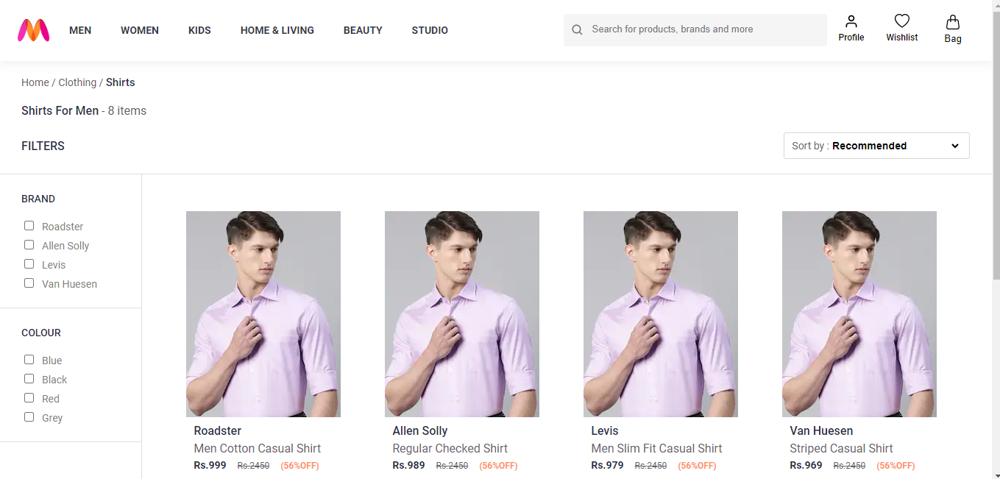

# Getting Started

These instructions will get you a copy of the project up and running on your local machine for development and testing purposes.

## Prerequisites

NPM / Yarn and Node.js installed

## Installing

Installing NPM modules. Execute these commands from the project directory
   ```
npm install
```

## Features
1. Browse Latest Trends: Explore a vast range of fashion products categorized for men, women, and kids.

2. Search and Filters: Find your desired items quickly using the search bar and apply filters based on brands, categories, sizes, and more.

3. Product Details: View detailed product descriptions, images, prices, and available sizes.

4. Add to Cart: Add products to your cart and see them update in real-time.

5. Wishlist: Save items for later by adding them to your wishlist.


### Main Page


### Filter & Wishlist 


### Wishlist Page


### Searched Products


### Details Page


### Cart


